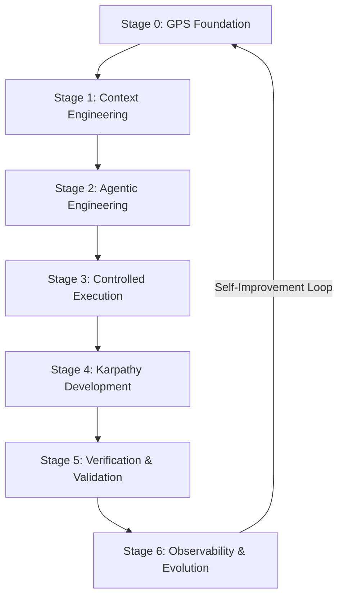

# Agentic Context Development Life Cycle (ACDLC) Architecture v1.5

The **Agentic Context Development Life Cycle (ACDLC)** is a strategic platform designed for modern software development powered by agentic AI models. It bridges the gap between raw natural language requests and production-grade software by treating **context as code**, **agents as a structured workforce**, **reasoning as an economic resource**, and the **entire lifecycle as a governed execution environment**.

---

## 🏛️ THE CENTRAL PILLARS

### 1. The GPS Foundation (Stage 0)
Traditional engineering starts with code; agentic engineering starts with **alignment**. Stage 0 forces the absolute definition of:
- **Goals**: The clear, measurable, and machine-verifiable destination.
- **Problems**: The precise pain points we are resolving, ensuring agents do not build unnecessary features.
- **Scope**: Explicit inclusions and strict exclusions (crucial to prevent agent scope-creep).
- **Success Metrics**: Quantitative constraints such as response times, test coverage, accuracy rates, and operational budget.

### 2. Context Engineering (Stage 1)
In an LLM-driven world, **context is the new source code**. The Context Development Life Cycle (CDLC) treats instructions, prompts, and metadata with source-control rigor.
- **Collection**: Sourcing data dynamically from codebases, MCP tools, and external docs.
- **Compression**: Stripping noise. Reducing hundreds of pages of documentation into high-density reference markdown blocks.
- **Prioritization**: Isolating critical tokens (system prompt, schemas) from optional guidelines.
- **Packaging**: Designing standard instructions, `.agentmd`, and skill sets.

### 3. Agentic Engineering (Stage 2)
Structuring AI models into a coordinated workforce with distinct roles and strict bounds.
- **Specialized Roles**: 
  - *Planner*: Synthesizes plans, tracks state, and coordinates tasks.
  - *Researcher*: Performs read-only analysis of documentation and codebases.
  - *Builder*: Executes writes, modifications, and command executions.
  - *Reviewer*: Executes independent verification steps.
  - *Optimizer*: Profiles performance and enhances implementation elegance.
- **Star Delegation Topology**: Agents operate in flat, specialized branches managed by a Planner rather than long linear chaining, preventing error propagation and context window pollution.

### 4. Reasoning Economics (Cross-Cutting Concern)
Intelligence has a financial and temporal cost. The **CPU Scheduler for Intelligence** dynamically routes tasks to avoid wasteful reasoning:
- **Simple**: Handled by fast, inexpensive models (e.g., Gemini 3.5 Flash) with single-turn prompts.
- **Moderate**: Routed to standard models with limited agentic loops.
- **Complex**: Handled by deep reasoning models (e.g., Gemini 3.1 Pro) with structured multi-replace tools.
- **Research**: Delegates to highly parallelized subagent structures utilizing broad search strategies.

### 5. Controlled Execution (Stage 3)
Robust execution frameworks are necessary to handle non-deterministic agent behaviors:
- **Task Scheduling**: Orchestrating task order and execution states.
- **Resource Management**: Dynamic monitoring of token expenditures and budgets.
- **Failure Recovery**: Implementing fallback modes when models loop, hallucinate, or hit context exhaustion.

### 6. Karpathy Development (Stage 4)
Grounded in clean-code principles optimized for both humans and AI readability:
- **Explicit over Clever**: Avoid magical or highly abstract architectures. Unroll loops, declare explicit variables, and keep execution pathways clear.
- **Readability over Abstraction**: Design code that can be read, debugged, and instantly understood by a junior engineer or an LLM parser.
- **Local Reasoning**: Code units should be self-contained so that a single file or function contains all the context needed for its modification.
- **Debuggability**: Clear telemetry, logging, and readable exceptions.

### 7. Verification & Validation (Stage 5)
Independent quality assurance separating code creation from quality verification.
- **Multi-Layer Validation**:
  - *Specification Validation*: Ensures built solution explicitly satisfies Stage 0 goals.
  - *Functional Validation*: Enforces test suite runs.
  - *Performance Validation*: Benchmarks against speed/latency metrics.
  - *Security Validation*: Verifies lack of secrets, prompt leak hazards, or insecure command vectors.
  - *Agentic Compliance*: Checks if subagents adhered to custom constraints.

### 8. Observability & Evolution (Stage 6)
The self-learning feedback loop. Telemetry, error reports, and run logs are fed back into the framework to dynamically refine and improve system performance over time.

---

## 🚀 PLATFORM EXECUTION ARCHITECTURE (v1.5)

### A. The Distributed Execution Runtime (`runtime/`)
Version 1.5 elevates the framework into an active **Execution Kernel** utilizing:
- **Task priority queues (`queue.py`)** with automatic retry thresholds and human escalation fallbacks.
- **Execution Workers (`worker.py`)** enforcing maximum token limits and preventing recursive subagent delegation.
- **Dependency Schedulers (`scheduler.py`)** enforcing Star topology workforce patterns dynamically.
- **Transactional state checkpointers (`checkpoint.py`)** providing safety snapshots to rollback state on compilation errors.

### B. Persistent Cognition Memory (`memory/`)
To preserve context budgets, the platform enforces memory isolation:
- **Working Memory**: Caches active variables, line references, and focus files for instant task edits.
- **Episodic Memory**: Logs execution histories and subagent traces dynamically.
- **Semantic Memory**: Retains permanent structures, schemas, and lessons-learned libraries.

### C. Declarative Policy Compilation
To eliminate runtime parsing latency and ensure policy determinism:
- The **Policy Compiler (`compile_policies.py`)** ingests declarative YAML configurations in `policies/` and compiles them into optimized JSON rule graphs inside `compiled-policies/`, dynamically computing and stamping platform dates.
