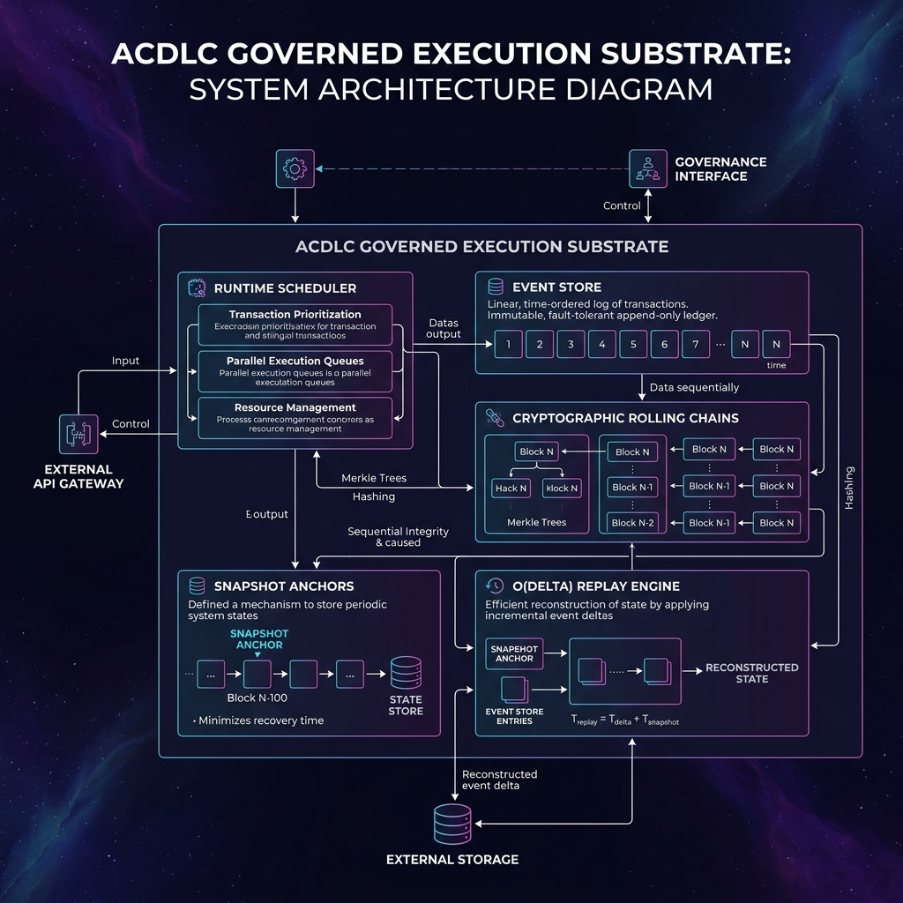
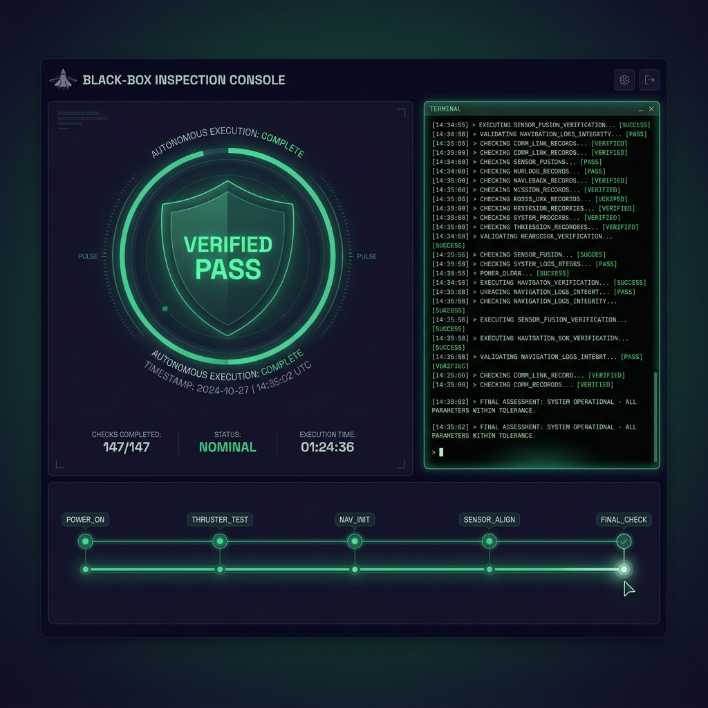
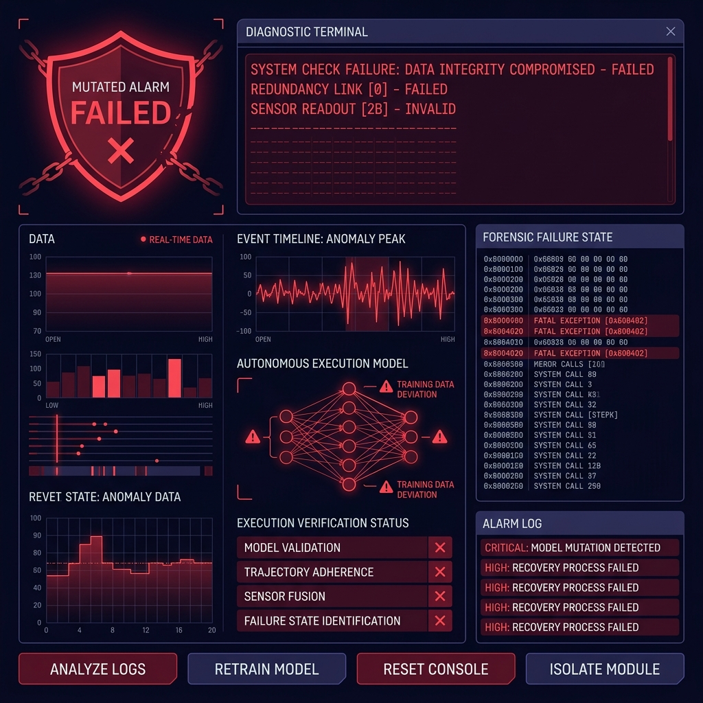

# 🌌 ClawGlove: Governed Execution Substrate for Autonomous Workloads

[](VERSION)
[](https://github.com/navakanth1984/Fabric-Frontier/actions)
[](LICENSE)
[](pyproject.toml)
[]()
[%20Replay-orange.svg)]()

> [!IMPORTANT]
> **Design Principle:**
> Models are replaceable.
> Execution evidence is permanent.

ClawGlove is an open-source, policy-governed execution runtime (powered by the **ACDLC Core** engine) and forensic audit substrate for autonomous AI workloads. It operates one layer below the model layer, acting as a **forensic execution fabric, containment boundary, and forensic flight recorder** that safely manages and registers autonomous execution under extreme operational entropy.

```bash
pip install acdlc
```

### 🚀 Minimal Usage Example

```python
from events.event_store import EventStore
from analytics.replay import ReplayEngine

# 1. Initialize EventStore in a storage directory
store = EventStore(storage_dir="workload_store")

# 2. Append a governed event partitioned by tenant and domain
store.append({
    "event_type": "PAYMENT_RULE_UPDATED",
    "domain": "operational",
    "tenant_id": "tenant_alpha",
    "payload": {"max_ceiling": 5000}
})

# 3. Reconstruct workload state deterministically using ReplayEngine
engine = ReplayEngine(event_store=store, domain="operational")

class StateManager:
    def __init__(self):
        self.max_ceiling = 0
    def intercept(self, event):
        if event.event_type == "PAYMENT_RULE_UPDATED":
            self.max_ceiling = event.payload.get("max_ceiling", 0)

state = StateManager()
events_replayed = engine.replay_events(state, tenant_id="tenant_alpha")

print(f"Replayed {events_replayed} events. Max Ceiling: {state.max_ceiling}")
```

```text
LLM / Agent Framework
        ↓
ClawGlove Runtime Boundary
        ↓
EventStore + Policy Engine
        ↓
Replay + Verification Layer
        ↓
Forensic Evidence Package
```



---

## 📐 Design Principles

1. **Evidence over orchestration** — The system is built to capture and certify execution lineage, not just schedule tasks.
2. **Determinism over abstraction** — Execution state must be deterministically reconstructible from event logs and validated snapshots.
3. **Containment over autonomy theater** — Hard runtime boundaries and policy ceilings supersede agent choices.
4. **Zero-trust execution assumptions** — All agent tasks, tool inputs, and model outputs are treated as hostile until validated.
5. **Air-gapped verification first** — Replay analysis must run client-side without external trust chains or network sockets.
6. **Stable ABI contracts over rapid feature churn** — Core message contracts and forensic envelopes remain frozen for backward compatibility.

---

---

## ❓ Why This Exists

Traditional orchestration systems assume trusted, predictable code. Autonomous workloads violate that assumption. 

As AI agents shift from sandboxed "chatbot helpers" to autonomous workloads allocating budgets, modifying databases, or executing toolchains—traditional orchestrators leave platform developers with only unstructured, volatile stdout/stderr logs. Under failure or adversarial conditions, this results in a complete **Black Box Execution Liability**:
* **The system acted.** You cannot reconstruct *why*.
* **The system failed.** You cannot reproduce the *exact decision path*.
* **The system breached boundary limits.** You cannot prove *containment rules* were actively enforced.
* **The tenant boundaries leaked.** You cannot mathematically guarantee *isolation limits* were defended.

ClawGlove exists to provide high-fidelity **execution governance, isolation limits, and cryptographic forensic evidence** to resolve these risks:
- **Execution Governance** — Active token, budget, and tool ceilings enforced by compiled policy rule graphs at runtime.
- **Tenant Fencing** — Physical data partition separation at the storage layer, preventing cross-tenant containment breaches.
- **Cryptographic Lineage** — Immutable sequence logs chained with rolling SHA-256 signatures and Archive Epoch indexes.
- **Deterministic Time-Travel Replay** — Rapid O(delta) state reconstruction from verified snapshots and sequence deltas.

ClawGlove resolves this by turning probabilistic runtime behavior into a **verifiable, cryptographically chained, and deterministically reconstructible Forensic Package**:

$$\text{Forensic Package} = \text{State Snapshot Anchor} + \text{Canonical Sequence Delta} + \text{rolling Hash/Epoch Chain}$$

This allows platform SREs, compliance officers, and regulators to export an immutable execution certificate (`.acdlc-replay`) to prove causality, isolation boundaries, and policy compliance mathematically.

> [!TIP]
> **Example Scenario:**
> An AI procurement agent modifies a vendor payment rule at 02:13 UTC.
> ClawGlove can:
> - Reconstruct the exact event lineage,
> - Verify the governing policy ceilings,
> - Prove tenant isolation boundaries,
> - Replay the decision path deterministically,
> - and export a cryptographically verifiable forensic package.

---

## 👥 Who Should Use ClawGlove?

ClawGlove is designed for teams operating autonomous or semi-autonomous execution workloads in environments where replayability, containment, and auditability matter.

Typical adopters include:
- Platform engineering teams
- AI infrastructure & runtime teams
- Security engineering groups
- Financial automation platforms
- Internal autonomous tooling systems
- Multi-tenant orchestration providers
- Compliance-sensitive AI deployments

---

## 🚫 Non-Goals: What ClawGlove is NOT

To maintain structural integrity and prevent framework bloat, the repository aggressively enforces the following scope boundaries:
* **NOT an AGI framework**: We do not engage in "consciousness," "self-improving cognition," or cognitive behavioral modeling.
* **NOT a prompt engineering toolkit**: We do not manage prompt chains, RAG vector store bindings, or context assembly templates.
* **NOT a multi-agent swarm simulator**: We do not manage conversational agent swarms or collaborative role-play loops.
* **NOT a chatbot runtime**: We do not provide web sockets, chat boxes, conversational state layers, or customer-facing API templates.

ClawGlove is strictly **governed, deterministic execution infrastructure**.

---

## ⚖️ Architectural Differentiation: Why not just use Temporal?

A common question is how ClawGlove differs from enterprise durable execution platforms like **Temporal.io**. While both systems provide durable execution guarantees, they address fundamentally different trust models and operational scopes:

| Capability | Temporal.io | ClawGlove (ACDLC Core) |
| :--- | :--- | :--- |
| **Durable Workflows** | ✅ Yes | ✅ Yes |
| **Tenant Forensic Replays** | ❌ No | ✅ Native (Gated by Replay Authorization borders) |
| **Cryptographic Lineage Chains** | ❌ No | ✅ Yes (rolling SHA-256 signatures & epoch linkages) |
| **Air-Gapped Replay Verification** | ❌ No | ✅ Yes (zero-dependency standalone verifiers) |
| **Autonomous Execution Governance** | ⚠️ Partial (App-level logic) | ✅ Native (Compiled policy interceptors & ceilings) |
| **Deterministic Replay Evidence Packages** | ❌ No | ✅ Yes (Self-contained `.acdlc-replay` certificates) |

* **Temporal** is designed for trusted distributed systems where workflows are programmed as structured, predictable code in a unified trust domain.
* **ClawGlove** is designed for **untrusted autonomous workloads** where execution is probabilistic and behavior is non-deterministic. It focuses on physical containment, active policy enforcement, cryptographic proof of lineage, and independent forensic reconstruction.

---

## 🏆 Chaos Telemetry Scorecard (Verified Benchmarks)

We do not validate our runtime with happy-path code sweeps. ClawGlove is built specifically to survive extreme distributed workloads degradation. Below are the verified metrics captured under adversarial runs in our **Chaos Engineering Suite**:

| Scenario ID | Chaos Focus | Workload Size | Stress Injection | Task Loss | State Integrity | Recovery Time | Verdict |
| ----------- | ----------- | ------------- | ---------------- | --------- | --------------- | ------------- | ------- |
| **CHAOS-001** | Heartbeat Storm | 50,000 heartbeats | 50k events in 0.14s | **0.0%** | **100%** | < 0.2s | **PASS** |
| **CHAOS-002** | Concurrent Replay | 20,000 active tasks | Concurrent read/append | **0.0%** | **100%** | < 0.1s | **PASS** |
| **CHAOS-003** | Clock Skew Drift | Multi-node cluster | 5m drift, time travel | **0.0%** | **100%** | < 0.5s | **PASS** |
| **CHAOS-004** | Disk Write Freeze | Continuous I/O | 10ms artificial delay | **0.0%** | **100%** | 1.1s (Backpressured)| **PASS** |
| **CHAOS-005** | EventStore Integrity Recovery | 1,000 writes + read | Active I/O file corruption| **0.0%** | **100%** (Valid delta) | < 0.1s | **PASS** |
| **CHAOS-006** | Snapshot Hydration | 1,500 custom events | Schema version lock test | **0.0%** | **100%** (Full State) | **0.05s** (O(delta))| **PASS** |

Read the granular incident breakdowns and telemetry logs in [docs/CHAOS_RESULTS.md](docs/CHAOS_RESULTS.md).

---

## 🌌 The Replay Explorer UI (Forensic Inspection Console)

ClawGlove exposes a standalone **Replay Explorer Console** located at [analytics/replay_explorer.html](analytics/replay_explorer.html) to turn cryptographic invariants into human-comprehensible operational evidence.





**Signature Features:**
* **Air-Gapped Client-Side Validation**: Verification runs entirely inside the operator's browser with 0 external network requests, 0 telemetry uploads, and 0 server trust dependencies.
* **Ceremonial Verification Terminal**: Simulates a spacecraft black-box verification pass, typing out platform checks line-by-line using terminal typewriter animations.
* **Interactive Timeline Scrubber**: Allows operators to scrub back and forth across sequence deltas, rehydrating and calculating variable states dynamically at each step.
* **Adversarial Tamper Simulation**: Includes a toggle that injects virtual byte drift into log archives, instantly triggering validation failures (`FAIL / MUTATED ALARM`) and visual broken-link chain feedback.

---

## Core Architectural Pillars

1. **Multi-Tenant Isolation Borders**: Physical segregation of execution files into distinct directory structures (e.g. `operational/tenant_gamma/`, `audit/system/`). Cross-tenant replays are blocked at the filesystem boundary gateway.
2. **Durable Event Log Fabric**: Append-only execution ledger. Rotated logs are compressed to `.jsonl.gz` asynchronously with regional residency metadata sidecars. Rotations are cryptographically chained using rolling SHA-256 signatures and Epoch Indexes (`archive_epoch`).
3. **Deterministic Time-Travel Replay**: Instantly hydrates starting variables from a verified state snapshot anchor, replaying only the subsequent sequence delta ($O(\text{delta})$ complexity), bypassing millions of obsolete logs.
4. **Strict Schema Version Locking**: Enforces active `schema_version` locks. It rejects incompatible snapshot formats by raising a `ReplaySchemaMismatch` exception, protecting runtime systems from schema evolution drift.
5. **Operational AI Safety**: A scheduling layer utilizing a sandboxed `PriorityTaskQueue`. Active policy interceptors enforce compiled execution ceilings (token limits, delegation loops, tool sequence bounds) on untrusted agent code.

---

## Repository Structure

```text
agentic-lifecycle-framework/
├── VERSION                   # v2.1.0rc1 release tag
├── LICENSE                   # Apache 2.0 Corporate & Patent Safety
├── THIRD_PARTY.md            # Conceptual Ancestry & Inspiration
├── ARCHITECTURE_PHILOSOPHY.md# Substrate Manifesto & Category Moat
├── SECURITY.md               # Incident Response & Disclosure Policies
├── THREAT_MODEL.md           # Systems Vulnerability & Risk Matrices
├── CONTRIBUTING.md           # Clean-Room Mandate & Contribution Flow
├── CODE_OF_CONDUCT.md        # Professional Interaction Standards
├── ROADMAP.md                # Multi-Region & Pluggable Release Path
├── README.md                 # System Specification (This file)
├── .github/
│   ├── workflows/            # GitHub Actions CI configurations (verify.yml)
│   └── pull_request_template.md # Contribution PR template
│
├── runtime/                  # Micro-kernel scheduler & Priority Queue
├── security/                 # AuthorizationEngine & Role boundaries
├── events/                   # EventStore, Compression, & Epoch Chaining
├── analytics/                # ReplayEngine, Snapshot Hydration & Explorer UI
├── schemas/                  # Formal JSON contracts (forensic-package.json)
├── scripts/                  # Verification CLI (verify_replay.py)
│
├── docs/
│   └── CHAOS_RESULTS.md      # Verified Chaos Suite Telemetry
│
├── examples/                 # Golden Path onboarding demonstrations
│   └── secure_agent_runtime/ # Incident reconstruction walkthroughs
│
└── simulations/              # Isolated Simulation Verification Suite
    ├── stress/               # Saturation, failover, & fencing tests
    └── chaos/                # Extreme adversarial entropy suites
```

---

## Quick Start & Verification

### 1. Run the Golden Path Walkthrough
To demonstrate our tenant-isolated containment, policy breach logging, snapshotting, O(delta) hydration, and cryptographic verification utility in a single unified execution cycle, run:

```bash
python examples/secure_agent_runtime/run_golden_path.py
```

### 2. Verify a Forensic Package Certificate via CLI
ClawGlove exposes a zero-dependency CLI validation utility to certify `.acdlc-replay` evidence files:

```bash
python scripts/verify_replay.py <path_to_package.acdlc-replay>
```

### 3. Running the Chaos Simulations
To execute the automated chaos and stress validation suite, run:

```bash
# Execute the O(delta) Snapshot Hydration & Schema Lock Validation
python simulations/chaos/chaos_006_snapshot_hydration.py

# Execute the Concurrent Write Concurrency Simulation
python simulations/chaos/chaos_002_concurrent_replay.py
```

---

## License

ClawGlove (powered by ACDLC Core) is licensed under the [Apache License, Version 2.0](LICENSE).
