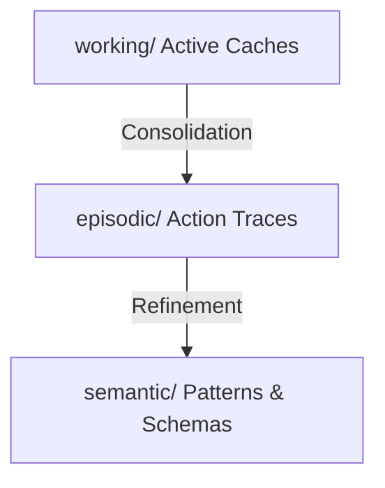

# ACDLC v1.5 Agent Memory & Persistent Cognition Layer

This directory structures stateful memory for executing agents. Instead of treating context as static strings, the memory layer categorizes and prioritizes memory registers into three primary spaces to optimize context efficiency.

---

## The Memory Hierarchy

### 1. Working Memory (`working/`)
- **Purpose**: Holds active, operational context for the immediate task or stage.
- **Content**: Function arguments, specific lines of code being edited, and active execution variables.
- **Context Behavior**: Heavily trimmed and updated at each task step to ensure the LLM's active prompt remains clean and highly focused.

### 2. Episodic Memory (`episodic/`)
- **Purpose**: Stores historical trace records of "What happened?".
- **Content**: Event sequences, past execution retries, tool logs, and raw error responses.
- **Context Behavior**: Offloaded to JSON logs to prevent prompt bloat. Spawning subagents branches these logs into isolated parent-relative trace files.

### 3. Semantic Memory (`semantic/`)
- **Purpose**: Stores permanent/reusable architectural schemas, facts, and lessons learned.
- **Content**: System interfaces, codebase maps, parsed rules, and dependency graphs.
- **Context Behavior**: Retained as strategic markdown blueprints that are loaded only when architectural updates or deep structural verifications are required.

---

## Schema Enforcement

All stateful memory partitions must validate against their corresponding JSON schemas in `memory/schemas/`:
- **`schemas/episodic-recall.json`**: Enforces structure for saved event episodes, ensuring error causes and step outcomes are easily parsed.
- **`schemas/working-context.json`**: Enforces strict variable types and state fields inside active working segments.
