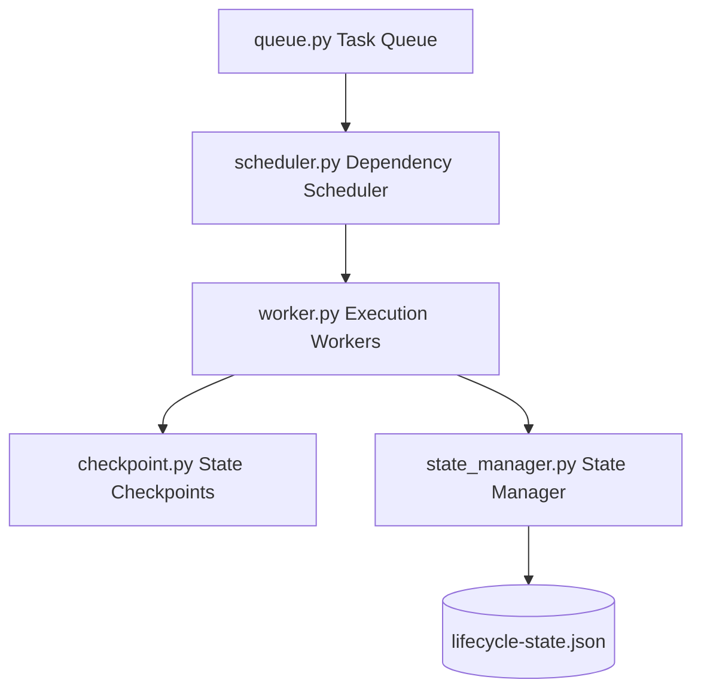

# ACDLC v1.5 Distributed Execution Runtime Kernel

This directory contains the operational execution layer of the **Agentic Context Development Life Cycle (ACDLC) Kernel**. It shifts the framework from an advisory lifecycle into a **governed execution runtime** by managing queues, workers, concurrency bounds, checkpoints, and state persistence.

---

## Architecture Components

### 1. Priority Task Queue (`queue.py`)
Provides an execution queue for tasks. It supports:
- **Priority Weights**: `High`, `Medium`, and `Low` task queue routing.
- **Retries**: Automates retries up to the maximum policy-enforced threshold.
- **Failures**: Traps errors and redirects items to the human escalation queue if thresholds are crossed.

### 2. Execution Worker (`worker.py`)
Responsible for running isolated task items. It:
- Sets execution contexts and executes target modules.
- Enforces active token ceilings and tool sequences.
- Aborts execution instantly if a policy violation occurs (e.g., recursive delegation).

### 3. Job Dependency Scheduler (`scheduler.py`)
Orchestrates worker threads and processes:
- Enforces Star topology limits (no linear subagent chains).
- Maps dependency DAGs to ensure parent tasks complete before children begin.
- Caps maximum concurrent executing tasks (`max_parallel_workers_count`).

### 4. State Checkpointer (`checkpoint.py`)
Captures and restores execution state:
- Captures system snapshots before high-risk execution runs.
- Automates rollsbacks to last stable checkpoint if tests or builds fail.

### 5. Persistent State Manager (`state_manager.py`)
- Syncs the runtime state with `schemas/lifecycle-state.json`.
- Integrates structured event logging to feed telemetry back to the observability engine.
