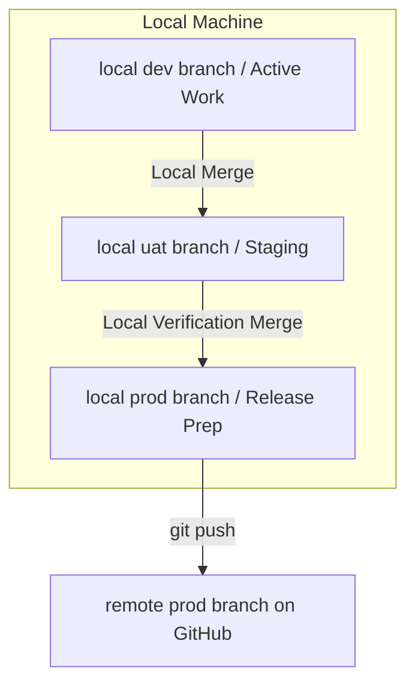

# Contributing to Fabric-Frontier

Welcome! This document outlines the developer standards, branch strategies, and release rules for managing this monorepository using our high-fidelity hybrid **Local-Staged / Remote-Pristine** workflow.

---

## 1. Branching & Promotion Workflow

We use a worktree-backed environment structure for the `nthdimensionacademy` site and `obsidian-vault`. To keep the remote GitHub repository clean and uncluttered, the development and staging environments exist **strictly locally** on your machine:



### Local Branches
- **`dev`** (*Local-Only*): The active workspace branch. All features, style updates, and knowledge captures land here first.
- **`uat`** (*Local-Only*): User Acceptance Testing and staging branch. Used for full-site testing and local previews before release.
- **`prod`**: Production-ready branch. **This is the only branch tracked on the remote GitHub repository.**

---

## 2. Commit Conventions

We strictly follow the **Conventional Commits** standard to maintain a clean, readable history:

- `feat(scope)`: A new feature or UI component (e.g. `feat(academy): add cosmic visuals`)
- `fix(scope)`: A bug fix (e.g. `fix(vault): correct path mapping`)
- `docs(scope)`: Changes to documentation or Obsidian notes (e.g. `docs(vault): add design extractor`)
- `style(scope)`: Code style or visual layout changes (no logic changes)
- `chore(scope)`: Maintenance, Git config, dependencies (e.g. `chore(ci): setup deploy pipeline`)

---

## 3. Production Release & Rollback Strategy

To ensure zero downtime and safe releases:

### Promoting a Release
1. Stage and commit all active work on your local `dev` worktree.
2. Navigate to your local `uat` worktree and merge `dev`:
   ```bash
   cd C:/Users/navka/navakanth001/worktrees/uat
   git merge --no-ff dev -m "chore(merge): promote dev to uat"
   ```
3. Verify your site locally. Once verified, navigate to your local `prod` worktree, merge `uat`, and push:
   ```bash
   cd C:/Users/navka/navakanth001/worktrees/prod
   git merge --no-ff uat -m "feat(release): promote uat to production"
   git push origin prod
   ```
4. Create and push a semantic release tag:
   ```bash
   git tag -a v1.0.0 -m "Release v1.0.0"
   git push origin v1.0.0
   ```

### Emergency Rollback
If a deployment to `prod` contains critical bugs:
1. **Do NOT force-push or rewrite git history.**
2. Perform a clean Git revert of the merge commit on your local `prod` worktree:
   ```bash
   git revert -m 1 <merge-commit-hash>
   ```
3. Push the revert commit immediately to `prod` to trigger the auto-revert Pages deployment:
   ```bash
   git push origin prod
   ```
4. Perform the fix on the `dev` branch, test on `uat`, and re-promote cleanly.
