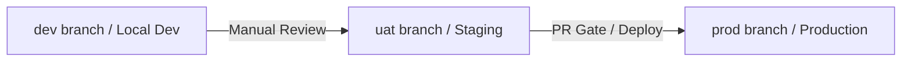

# Contributing to Fabric-Frontier

Welcome! This document outlines the developer standards, branch strategies, and release rules for managing this monoreposity.

---

## 1. Branching & Promotion Workflow

We use a worktree-backed environment structure for the `nthdimensionacademy` site and `obsidian-vault`:



- **`dev`**: The default development branch. All active development lands here.
- **`uat`**: Staging/User Acceptance Testing branch. For stable testing.
- **`prod`**: Locked down production branch. Deployed to GitHub Pages. Direct pushes are blocked.

---

## 2. Commit Conventions

We strictly follow the **Conventional Commits** standard to maintain a clean, readable history:

- `feat(scope)`: A new feature or UI component (e.g. `feat(academy): add cosmic visuals`)
- `fix(scope)`: A bug fix (e.g. `fix(vault): correct path mapping`)
- `docs(scope)`: Changes to documentation or Obsidian notes (e.g. `docs(vault): add design extractor`)
- `style(scope)`: Code style or visual layout changes (no logic changes)
- `chore(scope)`: Maintenance, Git config, dependencies (e.g. `chore(ci): setup deploy pipeline`)

---

## 3. Production Release & Rollback Strategy

To ensure zero downtime and safe releases:

### Releases
Every merge into `prod` is promoted via a Pull Request and must be tagged with a semantic version:
```bash
git tag -a v1.0.0 -m "Release v1.0.0"
git push origin v1.0.0
```

### Emergency Rollback
If a deployment to `prod` is broken or contains critical bugs:
1. **Do NOT force-push or rewrite git history.**
2. Perform a clean Git revert of the merge commit on your local `prod` worktree:
   ```bash
   git revert -m 1 <merge-commit-hash>
   ```
3. Push the revert commit immediately to `prod` to trigger the auto-revert deployment:
   ```bash
   git push origin prod
   ```
4. Perform the fix on the `dev` branch, test on `uat`, and re-promote cleanly.
