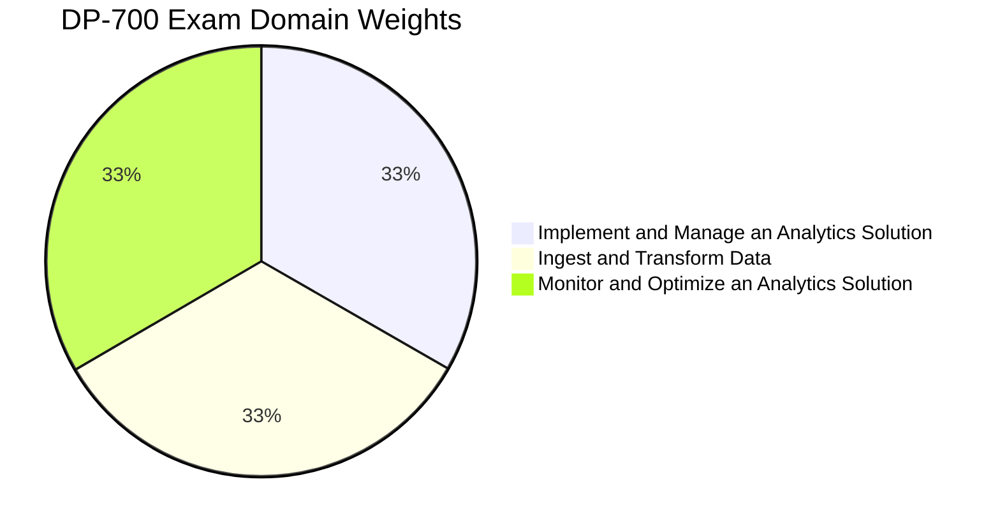
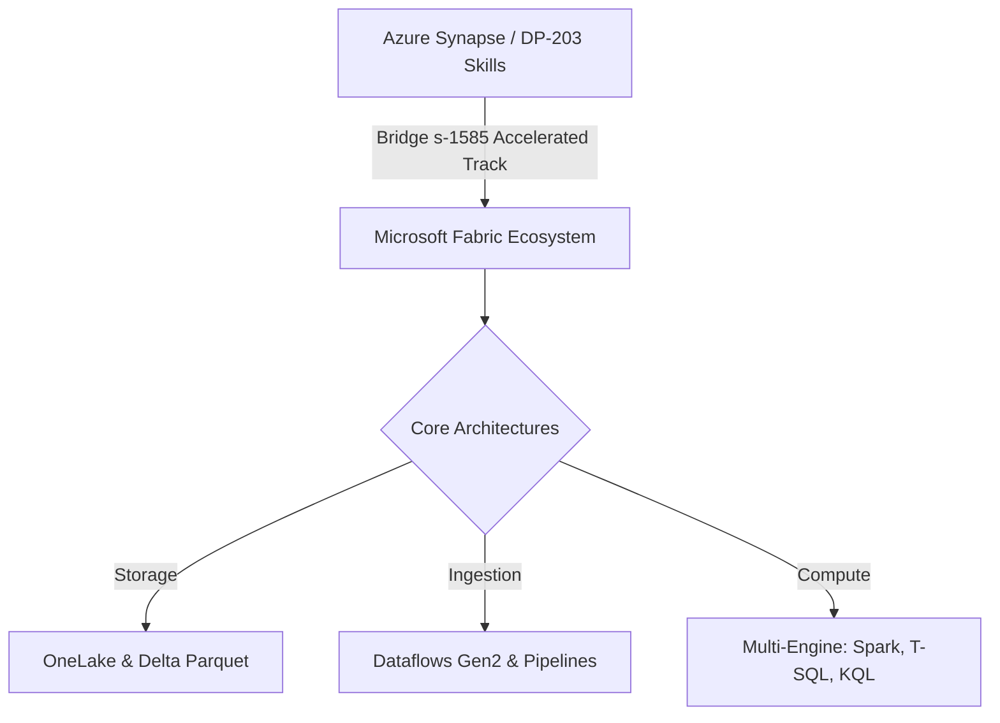

# DP-700: Microsoft Fabric Data Engineer Learning Path
*The Definitive Academy Curriculum to Mastering the Nth Dimension of Enterprise Analytics.*

Welcome to the **DP-700: Implementing Data Engineering Solutions Using Microsoft Fabric** master curriculum at Nth Dimension Academy. Led by Master Consultant and Microsoft Certified Trainer (MCT) **Navakanth Reddy Dumpa**, this learning path is structured to guide intermediate and advanced data professionals through the architectural and operational realities of the unified Microsoft Fabric ecosystem.

---

## 🌌 Course & Certification Quick Reference

<div align="center">

| Metric | Details |
| :--- | :--- |
| **Credential** | **Microsoft Certified: Fabric Data Engineer Associate** |
| **Official Exam** | [Exam DP-700: Implementing Data Engineering Solutions Using Microsoft Fabric](https://learn.microsoft.com/en-us/credentials/certifications/fabric-data-engineer-associate/) |
| **Official Course** | [Course DP-700T00-A: Implement data engineering solutions using Microsoft Fabric](https://learn.microsoft.com/en-us/training/courses/dp-700t00) |
| **Level / Tier** | Intermediate (Requires prior ETL, SQL, PySpark, or KQL experience) |
| **Exam Duration** | 100 Minutes (Proctored) |
| **Standard Cost** | $165 USD (Based on proctoring region) |
| **Retake Policy** | 24 hours after 1st attempt; varying cooldowns for subsequent attempts |

</div>

---

## 📊 Exam Domain Weights & Core Focus Areas

The DP-700 certification exam measures your proficiency across three equally weighted technical domains (30–35% each). 



### 1. Implement and Manage an Analytics Solution (30–35%)
*   **Environment Setup:** Configure Fabric workspace settings, Spark compute settings, capacities, and domains.
*   **Security & Access Control:** Manage workspace-level and item-level permissions (RBAC). Configure Row-Level Security (RLS), Column-Level Security (CLS), and Object-Level Security (OLS).
*   **Governance & Compliance:** Apply Microsoft Purview sensitivity labels, data masking, and item endorsements (Certified/Promoted).
*   **Lifecycle Management (CI/CD):** Enforce version control using Git integration (Azure DevOps/GitHub) and deploy across development, staging, and production environments using Fabric Deployment Pipelines.

### 2. Ingest and Transform Data (30–35%)
*   **Batch Ingestion Patterns:** Implement Data Factory Pipelines, Copy Activities, Mirroring, and Dataflows Gen2 to fetch data from diverse endpoints.
*   **Data Virtualization:** Design and implement OneLake shortcuts connecting external cloud platforms (Amazon S3, ADLS Gen2, Google Cloud Storage) without copying files.
*   **Advanced Data Transformations:** Build scalable Medallion Architectures (Bronze ➔ Silver ➔ Gold) inside Lakehouses using PySpark Notebooks, and inside Data Warehouses using structured T-SQL.
*   **Real-Time streaming:** Ingest high-velocity events with Eventstreams, route streaming records, process windows (sliding, tumbling, session), and store them inside KQL Databases.

### 3. Monitor and Optimize an Analytics Solution (30–35%)
*   **Unified Monitoring:** Trace execution statuses, durations, and bottlenecks across pipelines, notebooks, dataflows, and eventhouses via the Fabric Monitoring Hub.
*   **Compute Audit:** Track and analyze Capacity Unit (CU) consumption using the Fabric Capacity Metrics App to prevent capacity throttling.
*   **Performance Tuning:** Optimize storage layers via Delta Lake features (partitioning, Z-Order sorting, and file compaction using `OPTIMIZE` and `VACUUM` commands).
*   **Error Resolution:** Troubleshoot connection credentials, data quality pipelines, Spark runtime jank, and OneLake shortcut failures.

---

## 🗺️ Detailed Syllabus: The 5 Academic Tracks

Our training program is structured into 5 cohesive tracks, mapped directly to **Course DP-700T00-A** and the **Coursera DP-700 Specialization**.

### 🛠️ Track 1: Workspace Management, Version Control & Security
*   **Capacity & Workspace Governance:** Assign workspaces to dedicated F/P capacities. Set up tenant settings, delegate administrator rights, and configure Custom Spark Pools.
*   **Version Control & CI/CD Pipelines:** Link a Fabric Workspace to an Azure DevOps Git Repository. Stage, commit, push, and resolve conflicts. Configure a 3-stage Deployment Pipeline (Dev, Test, Prod) to release Lakehouses, Warehouses, and Power BI semantic models.
*   **Granular Security Models:** Configure Row-Level Security (RLS) and Column-Level Security (CLS) on SQL Analytics Endpoints. Configure data protection labels inside Microsoft Purview to track end-to-end lineage.

### 💾 Track 2: OneLake Storage Architecture & Medallion Strategy
*   **OneLake Blueprint:** Master the logical, unified "OneDrive for Data" layout. Design high-performance Delta Parquet tables to ensure ACID compliance.
*   **Medallion Architecture Design:**
    *   *Bronze (Raw):* Land data from multiple sources in its native format.
    *   *Silver (Cleansed/Conformed):* Standardize schemas, clean null values, remove duplicates, and write as optimized Delta tables.
    *   *Gold (Curated/Business-Ready):* Aggregate and structure data into dimensional models (Star/Snowflake schemas) for direct Power BI consumption.

### 🚀 Track 3: High-Scale Ingestion & Mirroring
*   **Fabric Ingestion Engines:** Choose between Data Factory Pipelines (best for orchestration and large batch movements) and Dataflows Gen2 (best for visual, Power Query-based ETL).
*   **Data Virtualization via Shortcuts:** Create instant shortcuts in OneLake to reference S3, ADLS Gen2, and Google Cloud Storage tables. Query external data in real-time with zero egress costs or synchronization delays.
*   **Database Mirroring:** Set up continuous, real-time database replication from Azure SQL Database, Cosmos DB, and Snowflake directly into OneLake as Delta tables.

### 💻 Track 4: Advanced Multi-Engine Transformations
*   **PySpark Data Processing:** Spin up high-compute Fabric Notebooks. Use PySpark to read unstructured/semi-structured files, join distributed tables, clean data at scale, and partition delta tables.
*   **T-SQL Warehouse Engineering:** Write complex stored procedures, views, and CTEs within the Synapse Data Warehouse. Execute high-performance multi-table joins using SQL Analytics Endpoints.
*   **Kusto Query Language (KQL):** Write lightning-fast real-time KQL queries to aggregate and analyze continuous time-series streaming data.

### 📡 Track 5: Real-Time Intelligence & Streaming Analytics
*   **Streaming Pipelines:** Build Eventstreams to ingest low-latency data feeds. Add custom applications, IoT devices, or database CDC feeds as streaming sources.
*   **Eventhouse & KQL Databases:** Design high-scale Eventhouses optimized for semi-structured text logs and real-time structured telemetry.
*   **Streaming Transformations:** Write sliding, tumbling, and session windows within Eventstream processors to filter and aggregate events before writing them into OneLake.

---

## 🧪 Hands-On Laboratory Directory
*Directly aligned with the official [MicrosoftLearning/mslearn-fabric](https://github.com/MicrosoftLearning/mslearn-fabric) and [MSFTHub](https://msfthub.com/labs/azure/dp-700/) laboratory curriculum.*

```
🎓 ACCASION TO MASTERY: Complete all 8 core laboratory exercises to build an enterprise-scale portfolio.
```

### 🧪 Lab 01: Create and Configure a Microsoft Fabric Lakehouse
*   **Goal:** Build a secure data lakehouse environment and ingest historical structured files.
*   **Step-by-Step Exercise:**
    1.  Provision a new Fabric Workspace assigned to a active trial/paid capacity.
    2.  Create a **Lakehouse** item named `NthDimension_Lakehouse`.
    3.  Upload sample sales CSV files into the `Files` zone of the Lakehouse using OneLake Explorer.
    4.  Create and run a Notebook using PySpark to read the CSV files and write them into the `Tables` zone as a managed **Delta table** named `FactSales`.
    5.  Switch to the auto-generated **SQL Analytics Endpoint** to run a SELECT query validating that the delta metadata has compiled correctly.

### 🧪 Lab 02: Orchestrate High-Scale Batch Ingestion with Pipelines
*   **Goal:** Construct an automated orchestration pipeline to copy multi-source databases into OneLake.
*   **Step-by-Step Exercise:**
    1.  Create a **Data Pipeline** named `Ingest_Customer_Data`.
    2.  Configure a **Copy Data** activity with a parameterized source pointing to an external Azure SQL Database.
    3.  Map the destination to the `NthDimension_Lakehouse` files repository as JSON format.
    4.  Add a **Notebook** transformation activity to execute after the Copy activity finishes.
    5.  Configure pipeline triggers (schedule and event-based) and test execution via the pipeline canvas.

### 🧪 Lab 03: Build No-Code ETL with Dataflows Gen2
*   **Goal:** Leverage Power Query Online to clean, transform, and load user profiles into a conformed table.
*   **Step-by-Step Exercise:**
    1.  Create a **Dataflow Gen2** item named `Clean_User_Profiles`.
    2.  Connect to an external Web API source containing raw user JSON payloads.
    3.  Apply transformation steps: clean column headers, filter out invalid email domains, replace null fields, and merge user records with country lookups.
    4.  Configure the **Data Destination** setting, pointing the output to the `FactSales` Lakehouse as a new table `DimUsers`.
    5.  Publish the dataflow, trigger a manual refresh, and check status in the Monitoring Hub.

### 🧪 Lab 04: Advanced Data Transformation using PySpark Notebooks
*   **Goal:** Perform complex, distributed data transformations on millions of records using Apache Spark.
*   **Step-by-Step Exercise:**
    1.  Create a **Fabric Notebook** and attach it to the `NthDimension_Lakehouse`.
    2.  Write PySpark cells to import `DimUsers` and `FactSales` tables.
    3.  Implement data cleansing routines: drop duplicate keys, parse unix timestamps into standard date formats, and calculate lifetime customer spend.
    4.  Save the transformed dataset to OneLake, partitioning the output folder by `TransactionYear` and `TransactionMonth`.
    5.  Validate the partitions visually inside the Lakehouse Explorer tab.

### 🧪 Lab 05: Delta Lake Optimization & Time Travel Operations
*   **Goal:** Manage files, compact tables, and query historical data versions to ensure optimal performance.
*   **Step-by-Step Exercise:**
    1.  Open a Fabric Notebook and load the `FactSales` Delta table.
    2.  Perform multiple simulated record updates and deletes to generate table versions in the Delta transaction log.
    3.  Write a time-travel query using PySpark to fetch records as of version 1:
        ```python
        df_v1 = spark.read.option("versionAsOf", 1).table("FactSales")
        ```
    4.  Run the **`OPTIMIZE`** command to consolidate small files and apply **Z-Order** sorting on the `CustomerID` column for query performance.
    5.  Run the **`VACUUM`** command (setting retention hours to 0) to permanently purge obsolete underlying files.
        > [!WARNING]
        > **Production Warning & Safety Lock Bypass:**
        > Delta Lake blocks vacuuming tables with zero retention by default to prevent irreversible data loss. In a learning sandbox environment, you must override this safety check:
        > ```python
        > # Disable the safety check configuration first
        > spark.conf.set("spark.databricks.delta.retentionDurationCheck.enabled", "false")
        > 
        > # Run the vacuum command via SQL analytics engine
        > spark.sql("VACUUM FactSales RETAIN 0 HOURS")
        > ```
        > **⚠️ CRITICAL NOTICE:** **NEVER** execute `VACUUM` with `0` hours in a production workspace. Doing so permanently destroys all history required for Time Travel and runs a severe risk of table corruption if concurrent write processes are active. Keep the industry default minimum of **7 days (168 hours)** in production.

### 🧪 Lab 06: Implement and Load a Synapse Data Warehouse
*   **Goal:** Create a enterprise data warehouse, load dimension tables using T-SQL, and run cross-database queries.
*   **Step-by-Step Exercise:**
    1.  Create a **Data Warehouse** named `NthDimension_Warehouse`.
    2.  Define Star Schema tables: create tables for dimensions (`DimProducts`, `DimDates`) and facts (`FactInventory`) using standard DDL SQL.
    3.  Load data from the `NthDimension_Lakehouse` Delta tables directly into the warehouse tables using high-performance T-SQL **`COPY INTO`** or **`INSERT INTO...SELECT`** commands.
    4.  Execute analytical queries involving window functions and aggregations in the built-in SQL Query Editor.
    5.  Create a visual query mapping the relationship fields to build the default Semantic Model.

### 🧪 Lab 07: Set Up Real-Time Eventstreams and KQL Databases
*   **Goal:** Ingest real-time telemetry streams and query them using Kusto Query Language.
*   **Step-by-Step Exercise:**
    1.  Create an **Eventstream** named `Live_Telemetry_Stream`.
    2.  Configure a streaming source: select a custom application generator or add a sample IoT device simulator stream.
    3.  Add an Eventstream transformation processor: filter out telemetry logs with temperature values below 50 degrees.
    4.  Create a **KQL Database** inside a Real-Time Intelligence workspace and add it as the eventstream destination.
    5.  Open a **KQL Queryset** and write Kusto queries to analyze continuous trends over 5-minute sliding windows:
        ```kql
        Live_Telemetry_Table
        | where TimeStamp > ago(1h)
        | summarize AvgTemp = avg(Temperature) by bin(TimeStamp, 5m), DeviceID
        ```

### 🧪 Lab 08: Implement Security, Governance & CI/CD Release
*   **Goal:** Secure data fields, set up workspaces in Azure DevOps, and deploy updates via release pipelines.
*   **Step-by-Step Exercise:**
    1.  Open the SQL Analytics Endpoint of `NthDimension_Lakehouse`.
    2.  Write T-SQL commands to configure Row-Level Security (RLS) ensuring sales users only see records matching their assigned region.
    3.  Apply Column-Level Security (CLS) to mask salary or social security columns from standard analytics queries.
    4.  Navigate to Workspace Settings, configure **Git Integration**, and link the workspace to a target repository branch. Commit all metadata changes.
    5.  Create a **Deployment Pipeline**, add the current workspace as the "Development" stage, and promote the schema changes into the "Testing" workspace stage.

---

## ⚡ Accelerated Track: Bridging Synapse / DP-203 to Fabric (s-1585)
*Inspired by the Microsoft Reactor Series [Get Certified: DP-700 Fabric Data Engineer (Accelerated)](https://developer.microsoft.com/en-us/reactor/series/s-1585/).*

Designed specifically for experienced Data Engineers (including those holding the **DP-203: Azure Data Engineer Associate** certification), this accelerated track bypasses fundamental cloud theories to focus exclusively on Fabric's disaggregated, multi-engine architecture.



### Key Architectural Deltas Covered:
1.  **Storage Consolidation (Synapse Pools vs. OneLake):** Transition from isolated storage pools (ADLS containers, Dedicated Pool storage) to the unified, single-virtual OneLake storage standard.
2.  **Shortcuts vs. ADF Copy Jobs:** Learn when to replace expensive, slow Azure Data Factory copy pipelines with OneLake shortcuts, achieving data virtualization instantly.
3.  **Compute Separation (Direct Lake Mode):** Leverage V-Order optimized Delta tables to allow Power BI semantic models to read data directly from OneLake without importing or duplicating memory (Direct Lake).
4.  **Security Integration:** Centralize permissions from individual resource ACLs into Purview and Unified Fabric workspace RBAC schemas.

---

## 🎓 Coursera Specialization: Exam Prep DP-700 Structure
*Mapped to the 3-course Whizlabs specialization on Coursera.*

For learners who prefer a guided, video-centric path, the **Exam Prep DP-700 Specialization** is broken down into three logical course modules:

```
📦 Exam Prep DP-700 Specialization (Coursera)
 ┣ 📜 Course 1: Implement and Manage Analytics Solutions
 ┃ ┗ Workspace settings, capacity provisioning, RBAC/RLS, Git integration, and deployments.
 ┣ 📜 Course 2: Ingest and Transform Data
 ┃ ┗ Batch/Streaming ingestion, shortcuts, mirroring, medallion architecture, Spark & T-SQL.
 ┗ 📜 Course 3: Monitor and Optimize an Analytics Solution
   ┗ Monitoring Hub, Capacity Metrics app, Delta V-Order tuning, compaction, and troubleshooting.
```

*   **Learning Tip:** Use this specialization to test your readiness through Mock Exams, scenario-based practice questions, and timed domain tests.

---

## 🔮 The Cosmic Guide's Academy Mandate
*Mastering data is not about moving files; it is about bending time and space to democratize intelligence.*

At the **Nth Dimension Academy**, we build solutions that serve millions of queries at sub-second latencies while keeping compute footprints minimal. As you walk through these tracks, remember:
*   Always favor **Shortcuts** over copying.
*   Always enable **V-Order** on tables targeted for Direct Lake reporting.
*   Always monitor your **CU consumption** to optimize enterprise spend.

*Your training is now initialized. Open your Fabric Workspace and begin Lab 01 to start your ascent.*
