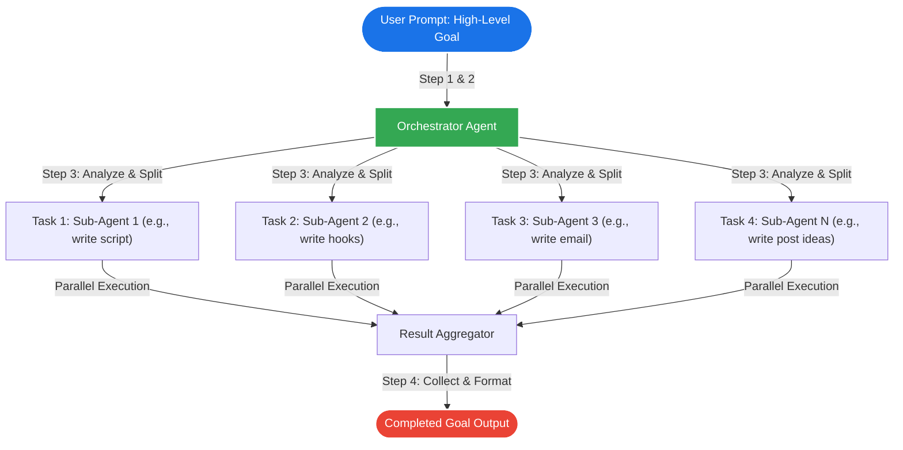

# Google's Anti-Gravity CLI: Parallel Multi-Agent Orchestration

## Key Idea
Google's Anti-Gravity CLI shifts the AI interaction paradigm from sequential, single-threaded prompting ("type, wait, respond") to a terminal-based **parallel orchestration system**. Users specify a high-level goal, and the orchestrator dynamically spawns multiple specialized sub-agents to execute sub-tasks concurrently, drastically reducing completion times for complex, multi-step workflows.

## Details

### The Parallel Multi-Agent Execution Lifecycle

Instead of micro-managing prompts sequentially, the Anti-Gravity CLI operates as a single-turn entry point that fans out to concurrent workers:



### The 5-Step Operational Process

| Step | Phase | Action & Description |
| :--- | :--- | :--- |
| **Step 1** | **Define High-Level Goal** | Describe an overarching objective (e.g., managing community growth, content calendars, onboarding pipelines) rather than micro-managing step-by-step. |
| **Step 2** | **Assign Parallel Tasks** | Explicitly define the number of parallel tasks and their roles directly in the prompt (e.g., "Agent 1 writes scripts, Agent 2 writes email hooks..."). |
| **Step 3** | **Orchestrated Execution** | The orchestrator agent parses the prompt, isolates execution contexts, and spawns independent sub-agents executing in parallel. |
| **Step 4** | **Result Aggregation** | Receive all completed deliverables concurrently. Complex workflows complete in **90 seconds to 2 minutes** without manual intervention. |
| **Step 5** | **Background Automation** | (Optional) Schedule the workflow to run automatically triggered by events (e.g., cron jobs or webhooks when a new member joins). |

### Comparison of AI Interaction Paradigms

```mermaid
gantt
    title Sequential vs Parallel AI Execution Time Savings
    dateFormat  s
    axisFormat %Ss
    
    section Sequential (Traditional)
    Prompt 1 (Define Goal)   : active, seq1, 0, 15s
    Wait for Output 1        : done, seq2, 15s, 35s
    Prompt 2 (Generate Blog)  : active, seq3, 35s, 50s
    Wait for Output 2        : done, seq4, 50s, 70s
    Prompt 3 (Generate Hooks) : active, seq5, 70s, 85s
    Wait for Output 3        : done, seq6, 85s, 105s
    Prompt 4 (Generate Email) : active, seq7, 105s, 120s
    Wait for Output 4        : done, seq8, 120s, 140s
    
    section Parallel (Anti-Gravity CLI)
    Submit High-Level Goal   : active, par1, 0, 20s
    Parallel Multi-Agent Run  : crit, par2, 20s, 90s
```

## Action / Next Steps
- [ ] Draft a parallel prompt that defines a high-level goal and explicitly splits work across at least 3 sub-agents.
- [ ] Test the execution speed and document results in `01-Projects/AI-Automation/`.
- [ ] Configure a recurring schedule or event trigger for background automation for routine workflows.
